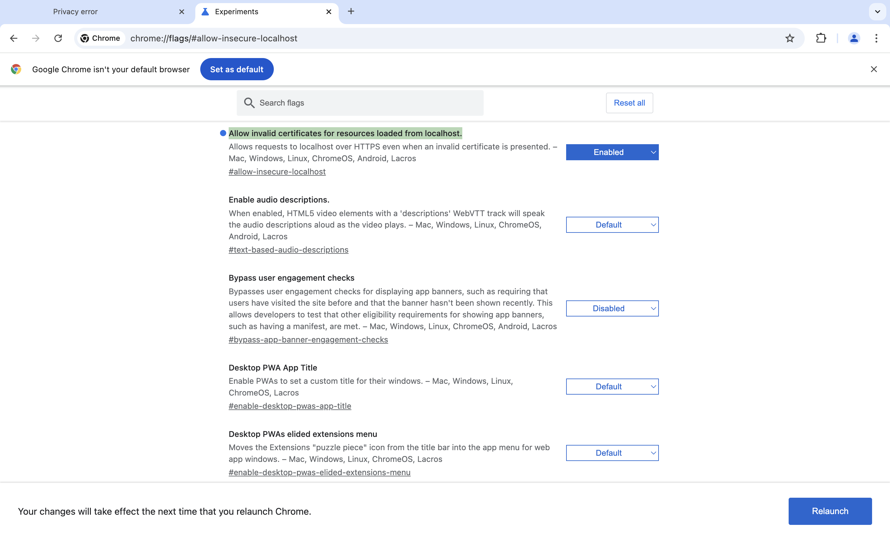

# <i>StreamR 🍿</i>
Your movie night assistant powered by collaborative filtering recommendations!

[](https://github.com/Shravsssss)

[](https://github.com/Naereen/StrapDown.js/blob/master/LICENSE)
[](https://doi.org/10.5281/zenodo.14025468)
[](https://www.python.org/)

[](https://github.com/CSC510-GROUP-40/MovieRecommender/actions/workflows/python-app.yml)
[](https://github.com/CSC510-GROUP-40/MovieRecommender/actions/runs/11980019418)
[](https://github.com/CSC510-GROUP-40/MovieRecommender/actions/runs/11980019418)
[](https://github.com/CSC510-GROUP-40/MovieRecommender/actions/workflows/unit_test.yml)
[](https://coveralls.io/github/CSC510-GROUP-40/MovieRecommender?branch=develop-test)


## Skip the endless scroll, StreamR has your next movie pick ready!

Are you spending more time picking a movie than actually watching one? Let StreamR solve your movie-night dilemma! Just let us know your preferences, and StreamR will recommend must-watch movies tailored just for you. 🍿🎬<br><br>


# <b>Table of Contents</b>

- [StreamR 🍿](#streamr-)
  - [Skip the endless scroll, StreamR has your next movie pick ready!](#skip-the-endless-scroll-streamr-has-your-next-movie-pick-ready)
- [Table of Contents](#table-of-contents)
  - [Overview 👁️](#overview-️)
  - [Exciting Future Plans 🔮](#exciting-future-plans-)
  - [Demo Video ▶️](#demo-video-️)
  - [How StreamR Works 📱](#how-streamr-works-)
  - [Tech Stack 👨‍💻](#tech-stack-)
  - [Setup and Installation ⚙️](#setup-and-installation-️)
    - [Install Dependencies](#install-dependencies)
      - [Create Google Client Credentials](#create-google-client-credentials)
  - [Getting Started](#getting-started)
      - [GOOGLE CHROME SETTINGS FOR SSL](#google-chrome-settings-for-ssl)
    - [Running Tests](#running-tests)
  - [Documentation 📚](#documentation-)
  - [Found a Bug? 🐛](#found-a-bug-)
  - [License 📃](#license-)
  - [Copyright](#copyright)

## Overview 👁️

Welcome to StreamR! 🚀<br>
Let us handle the hard part of picking a movie. Just provide your movie titles, and we'll curate a list of top recommendations perfect for your taste! 📽️<br>
Save time and make every movie night a hit. StreamR delivers recommendations based on your unique preferences so you can focus on the popcorn! 🍿<br>
Start your next great movie experience with a single click. 🎉<br><br>


## Exciting Future Plans 🔮

Our vision for StreamR includes:

1. Introducing more diverse genre, rating based recommendations.
2. Emailing users their latest recommendations for easy access.
3. Add multiple pages to go through more movies and reviews for search.
4. Enable sharing through social media and other options.
5. Add a subscribe option so that users can get emails according to their profile whenever a new movie is released.
6. Add an option for creating groups with shared watchlists.

StreamR can also be continuously tested with GitHub Actions, keeping our codebase rock-solid! 💪

## Demo Video ▶️ 

Get a sneak peek of StreamR in action! Click the link to watch the demo.

[Watch the animated video here](https://github.com/user-attachments/assets/0363fddc-0874-42bb-8e1b-e38a962394fa)

[Watch the demo video here](https://youtu.be/sNsCvfMRBTI)

## How StreamR Works 📱

StreamR does more than just recommend movies. Here’s what’s under the hood:

- Analyzes movie characteristics like genre and user reviews to make informed suggestions.
- Combines movie features and user preferences using machine learning for truly personalized picks.
- Suggests trailers for your top recommendations so you can preview before you watch. 
- Learns from feedback and improves recommendations with time.
- Lets you create an account, track movie history, add to watchlist, edit profile, and refine your recommendations.


## Tech Stack 👨‍💻

<details>
<summary>Python</summary>
Python is our core programming language, ideal for building the recommendation engine with its simplicity and power.
</details>

<details>
<summary>Flask</summary>
Flask serves as the backbone of our web app, making it easy to create and manage a dynamic and interactive user interface.
</details>

<details>
<summary>HTML & CSS</summary>
HTML structures our content, while CSS styles it to make sure you enjoy a sleek and user-friendly design.
</details>

<details>
<summary>JavaScript</summary>
JavaScript adds interactivity to our app, giving users a seamless experience.
</details>

## Setup and Installation ⚙️

To get started with StreamR:

- Python 3.5+
- pip
- Code Formatter - black
    `pip install black`
- Code Linter - Pylance (install it in VS Code)

### Install Dependencies
After cloning, install dependencies with:
```bash
pip install -r requirements.txt
```
#### Create Google Client Credentials
- First, note that you will need a Google Account. You already have one if you use Gmail.

- Go to the [Google developers credentials page](https://console.developers.google.com/apis/credentials).

- Once in, you may be prompted to agree to their terms of service. Should you agree to those, press the Create credentials button on the next page. Select the option for OAuth client ID:

- Select the Web application option at the top. You can provide a name for the client in the Name field as well. The name you provide will be displayed to users when they are consenting to your application acting on their behalf.

- if you’ll be running your web application locally for now, so you can set the Authorized JavaScript origins to https://127.0.0.1:5000 and Authorized redirect URIs to https://127.0.0.1:5000/login/callback. This will allow your local Flask application to communicate with Google.

- Finally, hit Create and take note of the client ID and client secret. You’ll need both later. You may also download the config file as json and update you `.env` file with the required fields
## Getting Started
1. Run this command `cd Code/recommenderapp`
2. Create a `.env` file inside `Code/recommenderapp`  and paste the content as found in `.env.example`. Populate the fields with your own credentials

3. Run the application with:
   ```bash
   python -m flask run --debug
   ```
4. Visit `http://127.0.0.1:5000/` in your browser to start exploring!
5. To test the google sign in feature run the app with `python -m flask run --debug --cert=adhoc` and visit the app on `https://127.0.0.1:5000/`

#### GOOGLE CHROME SETTINGS FOR SSL
for ssl to work locally on google chrome, you will have to do the following settings within your chrome browser.
- open this URL on chrome chrome://flags/#allow-insecure-localhost
- set the Allow invalid certificates for resources loaded from localhost. and enable this by clicking on relaunch at the bottom right. see image below

- note that this settings is not required for firefox 
  
  
### Running Tests
1. Make sure pytest is installed on your system.
2. switch to the tests directortory: `cd MovieRecommender/Code/tests`.
3. Run the tests with `pytest`


## Documentation 📚
Check out the [Wiki documentation](https://github.com/Shravsssss/MovieRecommender/wiki) for detailed information on how StreamR works and how to contribute.


## Found a Bug? 🐛
We’d love to hear from you! Please [open an issue](https://github.com/Shravsssss/MovieRecommender/issues) if you find any bugs or have feature requests.

## License 📃
StreamR is open-source under the MIT License.
- We chose the MIT license to promote freedom and flexibility for you to adapt StreamR to your needs.
- Enjoy, share, and contribute back to the community!

## Copyright
You can use below information for copyright.

```bash
cff-version: 1.2.0
message: "If you use this software, please cite it as below."
authors:
  - names: Sravya Yepuri, Chirag Hegde, Melika Ahmadi Ranjbar
title: "MovieRecommender"
version: "1.0.0"
date-released: "2024-11-01"
url: "https://github.com/Shravsssss/MovieRecommender"
```
